# Industrial Robotics — Visor Automation

**4-DOF Manipulator Design, MATLAB/Simscape Validation & TM Collaborative-Robot Experiments**

Academic industrial-robotics project combining the design and simulation of a custom **4-DOF Rz–Ry–Ry–Ry serial manipulator** for helmet-visor manipulation and inspection with physical laboratory experiments using a **TM collaborative robot**, machine vision and block-based industrial robot programming.

> **Status:** Completed academic team project  
> **Team size:** 3  
> **Tools:** MATLAB, Simulink, Simscape Multibody, SolidWorks, TM Robot programming & vision environment

---

## At a Glance

| | |
|---|---|
| **Main simulation task** | Design a manipulator capable of opening a helmet visor and positioning for hinge inspection |
| **Robot architecture** | 4 revolute joints: base, shoulder, elbow and wrist |
| **Joint axes** | Rz – Ry – Ry – Ry |
| **Task-specific IK** | Base held fixed, leaving 3 active joints |
| **Simulation** | MATLAB + Simscape Multibody |
| **Analysis** | FK, Jacobian, IK, workspace, manipulability, dynamics, torque and payload |
| **Trajectory planning** | Visor manipulation and camera-inspection trajectories |
| **Validation** | MATLAB dynamic calculations compared with Simscape results |
| **Physical robotics** | TM collaborative robot |
| **Lab tasks** | Pick-and-place, machine vision, tic-tac-toe, contact drawing, visor manipulation, hinge imaging and stamping |

---

# Project Overview

The project contained two connected areas of industrial robotics work:

1. **Design, modelling and simulation of a custom 4-DOF manipulator**
2. **Physical industrial-robot experiments using a TM collaborative robot**

The custom manipulator was designed around a helmet-visor automation task.

Two principal trajectories were studied.

### ABC — Visor Manipulation

```text
Start
  ↓
Approach Helmet
  ↓
Reach Visor
  ↓
Open / Manipulate Visor
```

### ADE — Inspection Motion

```text
Start
  ↓
Approach Helmet
  ↓
Move Around Visor
  ↓
Position for Hinge Inspection
```

The engineering workflow included:

- mechanical design
- forward and inverse kinematics
- Jacobian modelling
- workspace analysis
- manipulability analysis
- robot dynamics
- trajectory generation
- MATLAB simulation
- Simscape Multibody modelling
- MATLAB-vs-Simscape comparison
- payload analysis
- motor and transmission evaluation
- collaborative-robot programming
- machine vision
- physical manipulation experiments

---

# My Contributions

This was a **three-person academic team project**.

My work included:

### Mechanical Design
- CAD modelling of robot links and end-effector components
- robot geometry definition
- link-dimension definition
- extraction of mass and centre-of-mass information from SolidWorks
- preparation of geometry for Simscape

### Kinematics & Workspace
- forward kinematics
- position Jacobian
- inverse kinematics
- workspace sampling
- manipulability analysis
- workspace filtering
- YZ workspace analysis
- IK posture visualisation

### Dynamics & Simulation
- derivation of robot dynamics
- joint-space trajectory generation
- MATLAB torque calculation
- Simscape Multibody model development
- CAD geometry integration
- joint-position and joint-torque sensing
- MATLAB-vs-Simscape comparison
- payload studies
- motor/transmission evaluation

### Physical Industrial Robotics
I also worked directly on the TM robot laboratory tasks, including:

- pick-and-place programming
- tic-tac-toe task logic
- vision configuration
- pattern-detection parameter tuning
- contact drawing
- visor manipulation
- camera positioning
- hinge inspection
- stamping/contact tasks

---

# Robot Architecture

The designed robot is a **4-DOF serial manipulator**:

```text
q1 → Base rotation
q2 → Shoulder
q3 → Elbow
q4 → Wrist
```

with the axis sequence:

```text
Rz → Ry → Ry → Ry
```

Some original MATLAB files contain `SCARA` and `3DOF` in their filenames.

These names are preserved because they are part of the original project archive.

The mechanism itself is not a conventional SCARA architecture.

---

# Forward Kinematics

Forward kinematics were implemented to map joint configurations to the end-effector pose.

Conceptually:

```text
q = [q1 q2 q3 q4]
        ↓
Forward Kinematics
        ↓
End-Effector Pose
```

Relevant archived MATLAB functions are available under:

```text
matlab/kinematics/
```

including:

```text
SCARAdir_3DOF.m
SCARAjac_3DOF.m
SCARAjacP_3DOF.m
```

---

# Inverse Kinematics

The full manipulator contains four revolute joints.

For the helmet-visor task, however, the base rotation `q1` was held fixed during the inverse-kinematics calculation.

The task-specific IK therefore operated on:

```text
q2 → Shoulder
q3 → Elbow
q4 → Wrist
```

giving **three active DOFs**.

This is why several original functions are labelled `3DOF`, even though they belong to the same 4-DOF robot.

The reduced formulation was sufficient for the planned visor-interaction and inspection trajectories because the base orientation remained fixed during those motions.

---

# Workspace & Manipulability Analysis

The manipulator workspace was sampled numerically across the joint configuration space.

The analysis included:

- end-effector workspace sampling
- manipulability-index calculation
- 3D workspace visualisation
- manipulability colouring
- workspace boundary estimation
- table-height filtering
- base keep-out filtering
- fixed-base YZ workspace analysis
- IK-target visualisation

## Effective Workspace

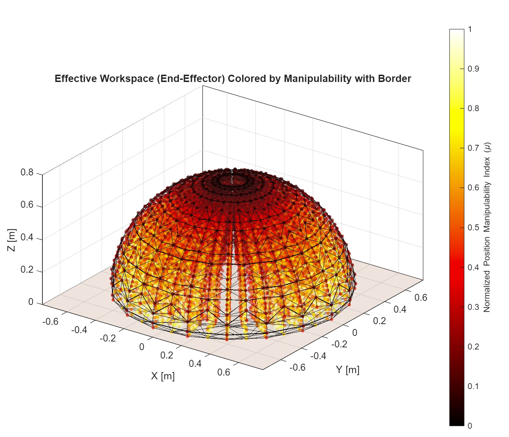

The colour scale represents the normalized position-manipulability index across sampled end-effector configurations.

## Fixed-Base YZ Slice

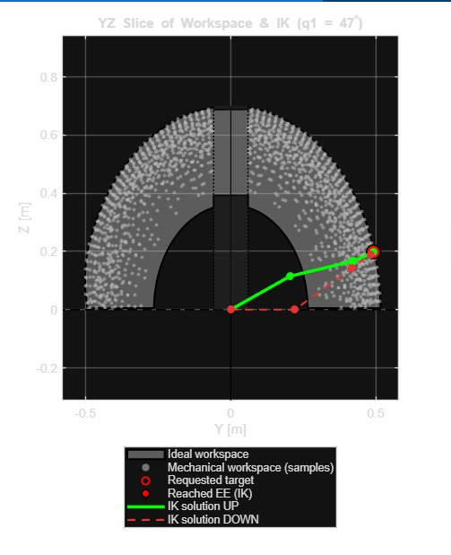

This view illustrates the task-specific fixed-base workspace and example IK solutions.

---

# Dynamic Modelling

The manipulator dynamics were derived using the standard robot equation:

```text
M(q)q̈ + C(q,q̇)q̇ + G(q) = τ
```

where:

- `M(q)` — inertia matrix
- `C(q,q̇)` — velocity-dependent terms
- `G(q)` — gravity terms
- `τ` — required joint torque

The archived MATLAB implementation includes separate functions for the dynamic components:

```text
matlab/dynamics/
├── SCARAM_3DOF.m
├── SCARAcoriolis_3DOF.m
├── SCARAg_3DOF.m
└── SCARAdirdin_3DOF.m
```

---

# Trajectory Planning

Multiple trajectory-generation methods were implemented and compared.

The archived code includes:

- trapezoidal profiles
- custom trapezoidal profiles
- cubic trajectories
- cycloidal trajectories
- spline trajectories
- line/parabolic-blend approaches
- minimum-time / rise-time utilities

Relevant files are available under:

```text
matlab/trajectory/
```

Two main task paths were then evaluated.

## ABC — Visor Manipulation

Trajectory ABC represented the motion used to approach and manipulate the visor.

Relevant implementation:

```text
ABC_Trajectory.m
lines_parabolas_3Joints.m
```

## ADE — Inspection Path

Trajectory ADE represented the inspection movement around the visor and toward the hinge region.

Relevant implementation:

```text
Main_ADE.m
Spline_traj_CDE.m
SplineCubica.m
```

Different trajectory methods were compared to determine which behaviour was more appropriate for the specific task.

---

# Simscape Multibody Model

The manipulator was also implemented in **Simscape Multibody**.

The model included:

- four revolute joints
- correct joint-axis orientation
- rigid transforms
- imported CAD geometry
- commanded joint trajectories
- joint-position sensing
- joint-velocity outputs
- joint-torque sensing
- simulation-data logging

## Full Multibody Model

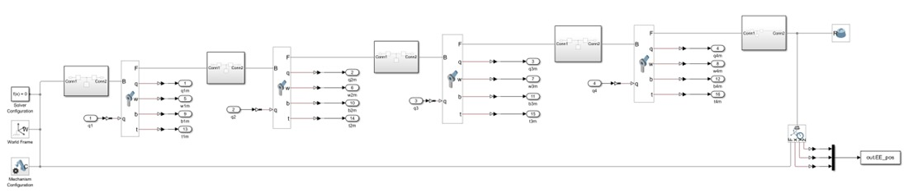

## Simulation I/O

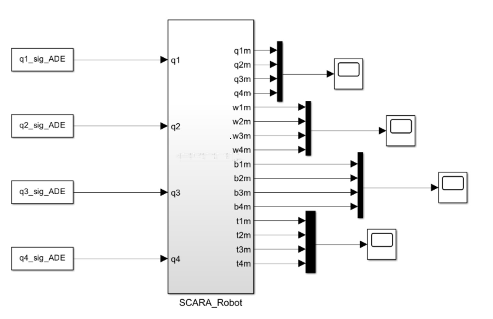

Simscape models are available under:

```text
simscape/models/
```

---

# MATLAB vs Simscape Validation

The same robot motions were evaluated using:

```text
MATLAB Dynamic Model
        ↕
   Comparison
        ↕
Simscape Multibody
```

Joint torque trends from both modelling approaches were compared.

The purpose was to cross-check the analytical/dynamic implementation against the multibody simulation rather than claim exact numerical equivalence.

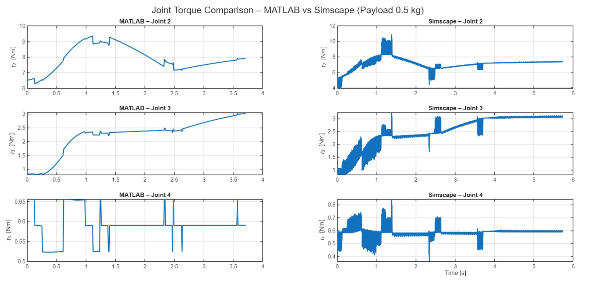

---

# Payload Analysis

Payload influence was evaluated for:

- **0 kg**
- **0.5 kg**
- **0.75 kg**
- **1.0 kg**

The analysis showed how loading affected the required torque across the manipulator joints.

### No Payload

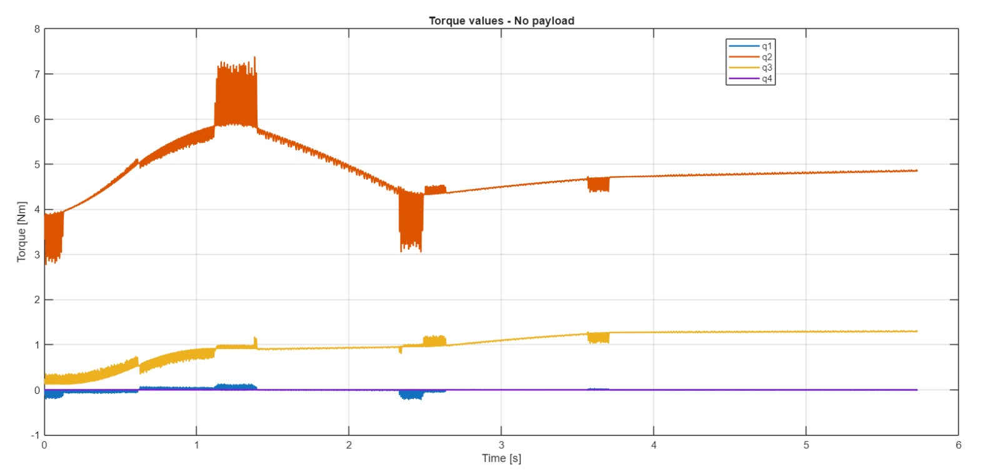

### 0.5 kg Payload

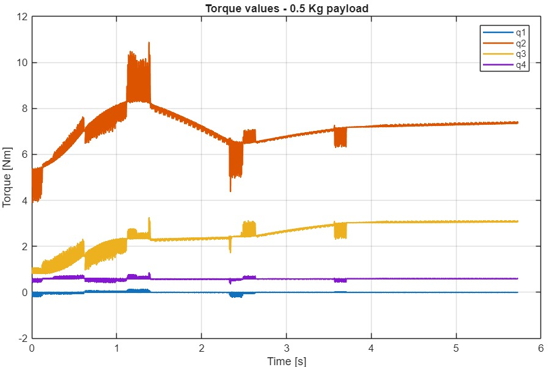

### 0.75 kg Payload

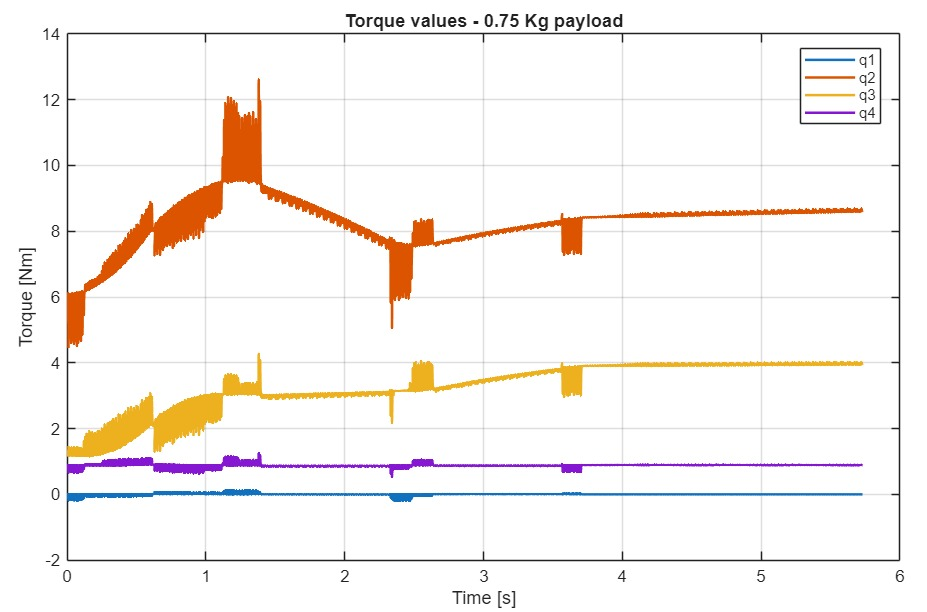

### 1.0 kg Payload

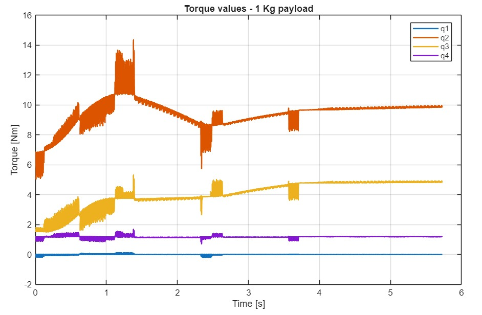

The tested payload cases remained part of the actuator/transmission design study; the heavier cases were not treated as robot failure cases.

---

# Motor & Transmission Analysis

Required joint torque was compared against candidate Mitsubishi servo-motor capabilities.

Transmission reductions were then considered to reduce required motor-side torque and provide design margin.

The study considered:

- rated torque
- maximum torque
- joint torque
- transmission reduction
- motor power
- payload
- worst-case trajectory loading

## Torque with Transmission Reduction

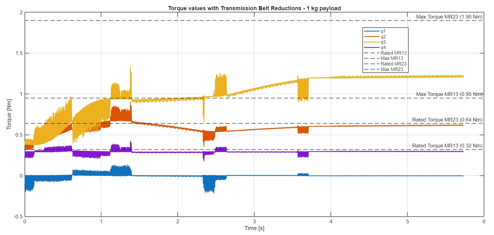

## Motor Power

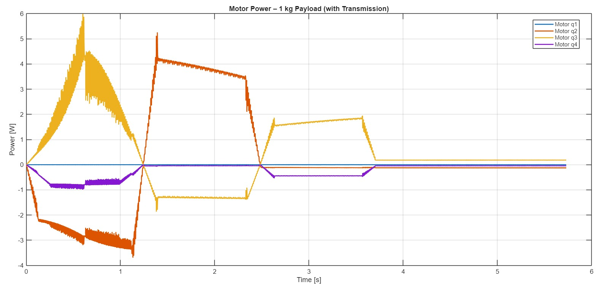

The exact final motor part numbers and transmission ratios have not yet been recovered from the archived project material, so they are intentionally not reconstructed from memory here.

---

# Physical TM Collaborative-Robot Laboratory

The second part of the project involved practical industrial-robot programming using a **TM collaborative robot**.

The exact robot model has not yet been recovered from the original course documentation.

Programming used the TM Robot graphical/block-based control and vision environment.

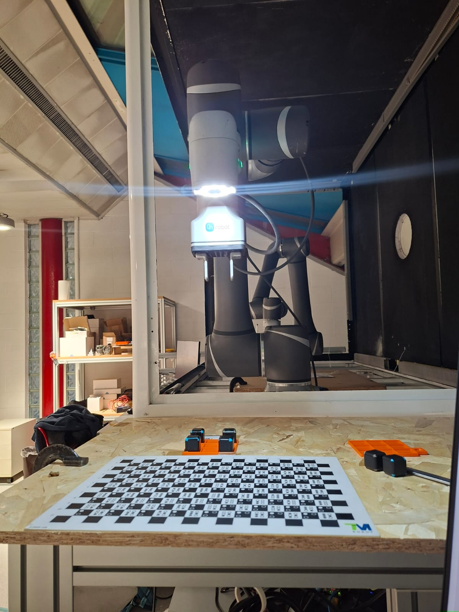

---

# Pick-and-Place

One task required the robot to move objects between **six predefined source positions and six destination positions**.

The positions were predefined rather than detected with vision.

The programmed sequence was:

```text
Approach
   ↓
Pick
   ↓
Transfer
   ↓
Place
   ↓
Repeat
```

[▶ Watch the pick-and-place demonstration](media/lab/pick_and_place.mp4)

---

# Machine Vision & Tic-Tac-Toe

The integrated vision system was used for pattern-based object detection.

I configured parameters including:

- pattern selection
- search range
- minimum matching score
- rotation handling
- image-pyramid layers

The system returned:

- image-space X
- image-space Y
- rotation
- matching score

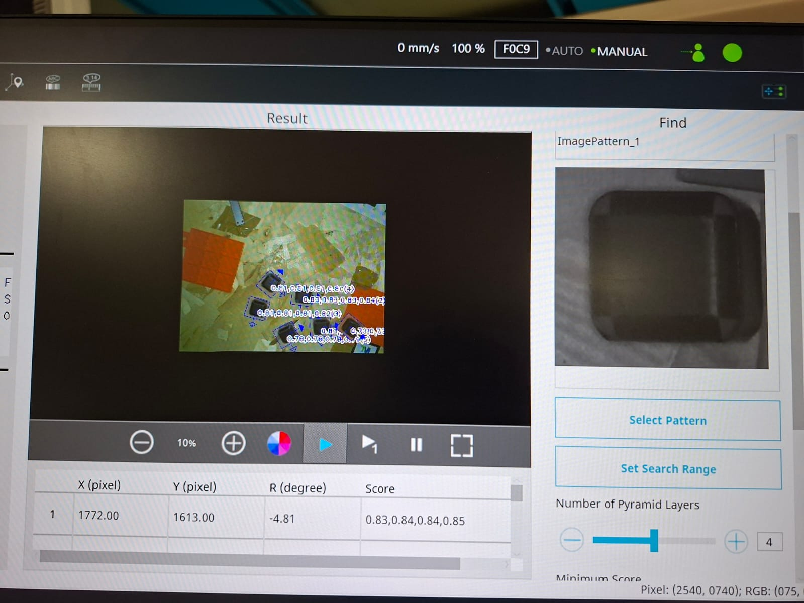

The detected state was then used by the block-based task logic to determine where the robot should place its next piece.

```text
Camera
   ↓
Pattern Detection
   ↓
Position / Rotation / Score
   ↓
Task Logic
   ↓
Robot Motion
```

[▶ Watch the tic-tac-toe demonstration](media/lab/tic_tac_toe.mp4)

---

# Contact Drawing

Another laboratory exercise used a pencil attached to the robot end effector.

The goal was to follow a drawing path while maintaining suitable contact with the surface.

Dedicated force sensing was not used for this task.

Contact was instead tuned experimentally through:

- robot pose
- tool orientation
- Z-depth
- trajectory accuracy

This exercise highlighted the practical difference between free-space positioning and surface-contact manipulation.

---

# Final Helmet-Visor Task

The final laboratory exercise combined manipulation, inspection and contact operations.

The programmed sequence was:

```text
Start
  ↓
Approach Helmet
  ↓
Open Visor
  ↓
Rotate / Reposition
  ↓
Close Visor
  ↓
Position Camera at Hinge
  ↓
Capture Inspection View
  ↓
Return to Start
  ↓
Repeat at Higher Speeds
  ↓
Move to Stamp
  ↓
Dip Stamp
  ↓
Apply Stamp to Helmet
  ↓
Repeat at Different Angles
```

The visor sequence was repeated **three times at progressively higher speeds** to observe whether the manipulation remained successful.

The stamping operation was then repeated at different robot orientations.

Evaluation was primarily based on successful physical task execution and visual observation.

Formal quantitative measurements of force, positioning error and repeatability were not recorded.

[▶ Watch the final helmet-visor task](media/lab/helmet_visor_task.mp4)

---

# What Was Implemented

| Component | Status |
|---|---|
| 4-DOF manipulator design | ✅ Implemented |
| CAD development | ✅ Implemented |
| Forward kinematics | ✅ Implemented |
| Jacobian | ✅ Implemented |
| Task-specific inverse kinematics | ✅ Implemented |
| Workspace analysis | ✅ Implemented |
| Manipulability analysis | ✅ Implemented |
| Dynamic model | ✅ Implemented |
| MATLAB trajectory generation | ✅ Implemented |
| Simscape Multibody model | ✅ Implemented |
| CAD import into Simscape | ✅ Implemented |
| MATLAB-vs-Simscape comparison | ✅ Implemented |
| Payload analysis up to 1 kg | ✅ Implemented |
| Motor/transmission study | ✅ Performed |
| TM robot pick-and-place | ✅ Demonstrated |
| Machine-vision configuration | ✅ Demonstrated |
| Tic-tac-toe task | ✅ Demonstrated |
| Contact drawing | ✅ Demonstrated |
| Visor manipulation | ✅ Demonstrated |
| Hinge imaging | ✅ Demonstrated |
| Stamping/contact task | ✅ Demonstrated |
| Quantitative real-robot force validation | ❌ Not performed |
| Formal real-robot positioning-error study | ❌ Not recorded |
| Formal repeatability dataset | ❌ Not recorded |

---

# Repository Structure

```text
industrial-robotics-visor-automation/
│
├── README.md
├── .gitignore
│
├── matlab/
│   ├── analysis/
│   ├── dynamics/
│   ├── kinematics/
│   └── trajectory/
│
├── simscape/
│   ├── Simscape_Values.m
│   ├── Trapezoidal_signal.mat
│   ├── models/
│   │   ├── Project_Simscape.slx
│   │   └── SCARA_Simscape.slx
│   └── data/
│
├── cad/
│   ├── solidworks/
│   │   └── Arm_022.SLDPRT
│   └── step/
│       ├── Arm_00_Assembly.STEP
│       ├── Arm_00_Assembly_2.STEP
│       ├── Arm_01_Assembly.STEP
│       ├── Arm_02_Assembly.STEP
│       ├── Base_Assembly.STEP
│       └── Gripper_Assembly.STEP
│
└── media/
    ├── simulation/
    ├── results/
    └── lab/
```

Generated Simulink caches, build artefacts and autosave files are excluded from version control.

---

# Running the Archived Project

This repository has been reconstructed from the surviving academic project files.

The original MATLAB release and complete original development environment have not yet been recovered.

At minimum, the project requires:

- MATLAB
- Simulink
- Simscape
- Simscape Multibody

Start with the Simscape models in:

```text
simscape/models/
```

and the MATLAB code under:

```text
matlab/
```

Some archived scripts may require path adjustments depending on where the repository is cloned.

The STEP files in:

```text
cad/step/
```

provide software-independent CAD geometry for inspection or import into compatible CAD tools.

---

# Limitations

Several original project details have not yet been recovered:

- exact final joint-limit configuration
- exact Mitsubishi motor part numbers
- exact transmission ratios
- exact TM collaborative-robot model
- exact TM software version
- original MATLAB release

These values are intentionally left unspecified instead of being reconstructed from memory.

The physical laboratory experiments were assessed primarily through successful task execution rather than a formal quantitative performance dataset.

---

# Team Work & Attribution

This repository contains material originating from a **three-person academic team project**.

The **My Contributions** section identifies the areas I personally worked on.

The repository also preserves original team-generated project files and naming conventions where useful for reproducibility. The presence of a file in this repository should therefore not automatically be interpreted as a claim of sole individual authorship.

No third-party or university-owned source code is intentionally presented here as my own work.

---

# Skills Demonstrated

This project provides evidence of experience in:

- robot kinematics
- inverse kinematics
- Jacobians
- workspace analysis
- manipulability
- dynamics
- trajectory planning
- MATLAB
- Simulink
- Simscape Multibody
- SolidWorks
- CAD integration
- torque analysis
- payload analysis
- actuator sizing
- transmission analysis
- collaborative robotics
- industrial robot programming
- machine vision
- pick-and-place
- contact tasks
- robot inspection tasks
- physical robot testing

---

# Project Status

✅ **Completed academic robotics project**

The principal simulation, analysis and physical laboratory tasks are complete.

This repository is a cleaned and documented reconstruction of the original project archive.
